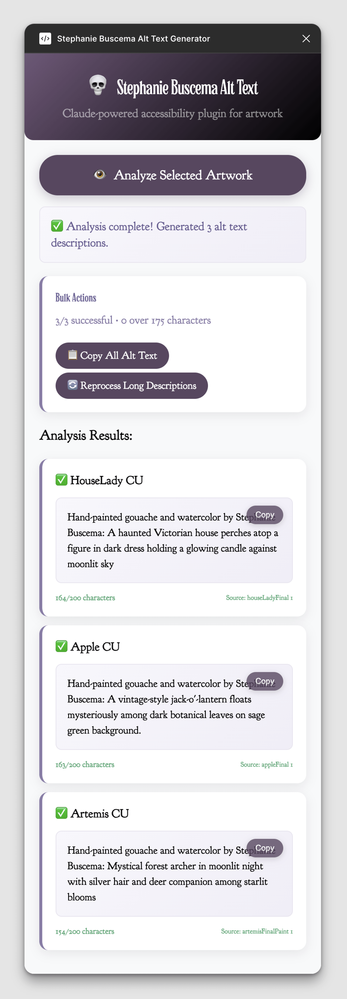
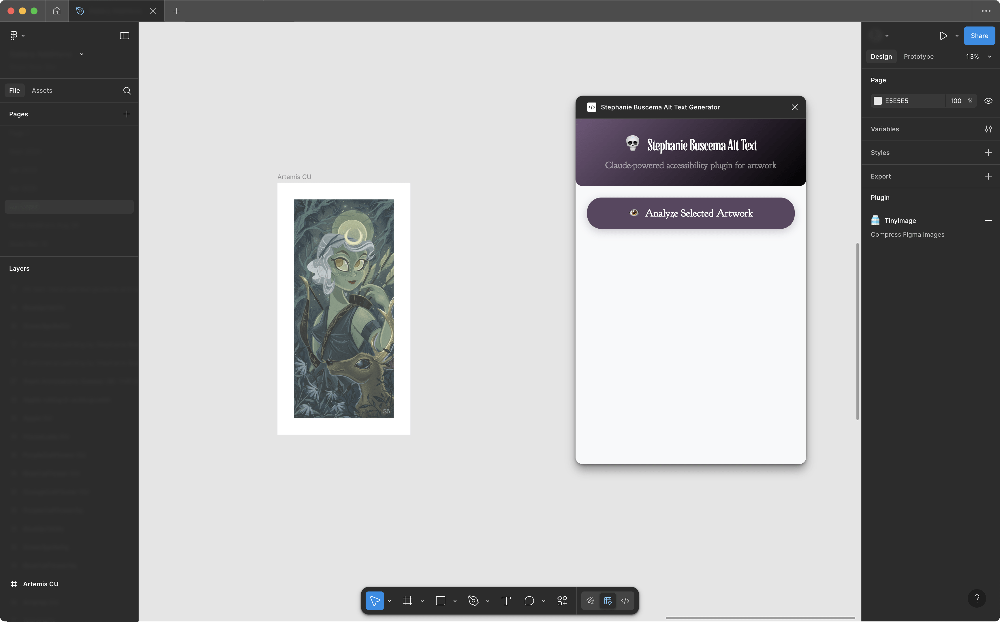
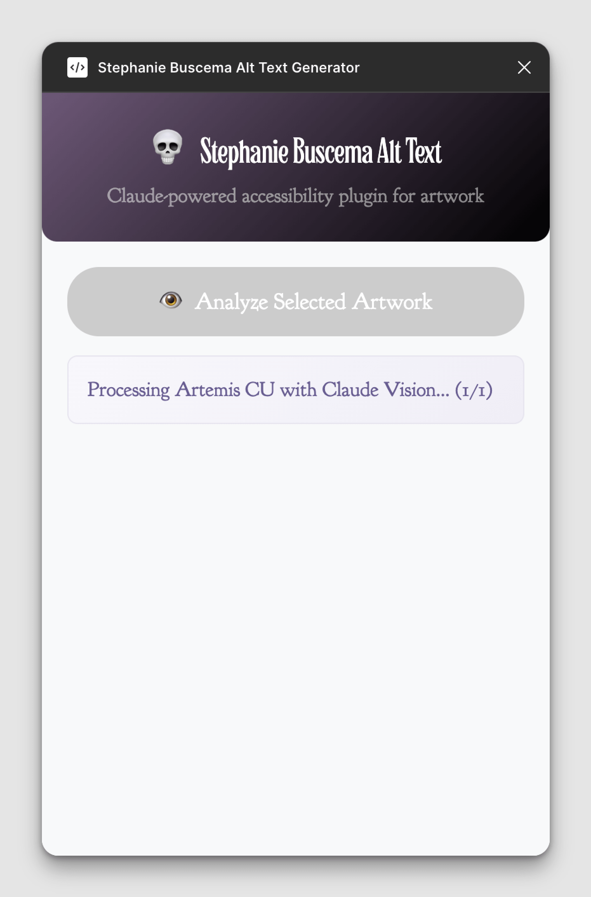
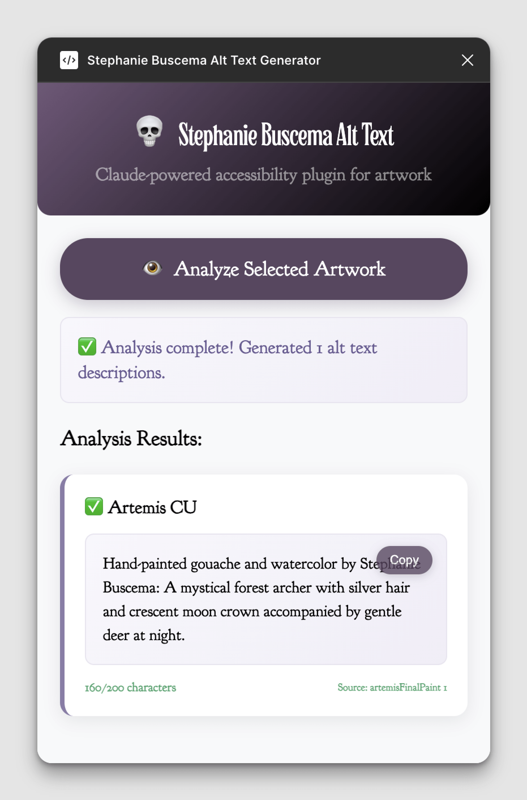

# Art Alt Text Generator - Figma Plugin

A Figma plugin that uses Claude Vision AI to automatically generate accessibility alt text descriptions for artwork and images.



## 🚀 Quick Start

1. **Deploy the API backend** to Vercel (5 minutes)
2. **Install the Figma plugin** from the files in `/plugin/`
3. **Select artwork** in Figma and generate alt text instantly


## ✨ Features

- 🔍 **AI-Powered Analysis** - Uses Claude Vision to understand artwork context
- 🎨 **Art-Focused** - Designed specifically for visual artwork and illustrations  
- ♿ **Accessibility First** - Generates proper alt text for screen readers
- 📏 **Character Limits** - Optimized 150-200 character descriptions
- 🔄 **Batch Processing** - Handle multiple artworks at once
- 📋 **Easy Copy** - One-click copying for immediate use

## How It Works


1. **Select artwork** in your Figma file
2. **Open the plugin** and click "Analyze Selected Artwork"
3. **Review generated descriptions** with character counts and quality indicators
4. **Copy alt text** for immediate use in your projects







## Repository Structure

Your repository should be organized like this:

```
figma-art-alt-text-generator/
├── README.md                 # Main documentation
├── LICENSE                   # MIT license
├── api/                      # Next.js backend for Vercel deployment
│   ├── package.json         # Dependencies
│   ├── vercel.json          # Deployment configuration
│   └── app/
│       └── api/
│           └── claude/
│               └── route.ts  # Claude API endpoint
├── examples/                 # Screenshots and demo images
│   ├── plugin-results-demo.png
│   ├── plugin-interface.png
│   ├── figma-integration-wide.png
│   ├── figma-integration.png
│   ├── plugin-processing.png
│   └── plugin-single-result.png
└── plugin/                   # Figma plugin files
    ├── manifest.json        # Plugin configuration
    ├── code.js              # Main plugin logic
    └── ui.html              # User interface
```

## Overview

The plugin consists of two main parts:
1. **Figma Plugin** - Runs inside Figma, analyzes selected nodes, exports images
2. **Next.js API Backend** - Deployed to Vercel, handles Claude API communication

## Setup Instructions

### Part 1: Deploy the API Backend

1. **Create a new Next.js project:**
   ```bash
   npx create-next-app@latest art-alt-text-api --typescript --app-router
   cd art-alt-text-api
   ```

2. **Install dependencies** using the provided `package.json`

3. **Create the API route:**
   - Create `/app/api/claude/route.ts` with the provided code
   - Add `vercel.json` configuration file

4. **Get a Claude API key:**
   - Sign up at https://console.anthropic.com/
   - Create an API key
   - Note: You'll need billing set up as this uses Claude's vision capabilities

5. **Deploy to Vercel:**
   ```bash
   npm install -g vercel
   vercel login
   vercel
   ```

6. **Set environment variables in Vercel:**
   - Go to your Vercel dashboard
   - Navigate to your project settings
   - Add environment variable: `CLAUDE_API_KEY` with your Claude API key

7. **Note your deployment URL** (e.g., `https://your-app-name.vercel.app`)

### Part 2: Configure the Figma Plugin

1. **Update the API URL:**
   - Open `code.js`
   - Replace `https://your-plugin-api.vercel.app` with your actual Vercel deployment URL
   - Update the same URL in `manifest.json`

2. **Customize for your specific artist/style:**
   - In `code.js`, find the Claude prompt in the `analyzeWithClaudeVision` function
   - Modify the text prompt to include specific information about your artist's style, medium, or requirements
   - Example customizations:
     ```javascript
     // For a specific artist
     text: 'Create alt text for this [Artist Name] artwork in exactly 150-200 characters. Include the artist name, medium (typically gouache and watercolor), and describe the key visual elements focusing on [specific style elements like "whimsical creatures," "vintage aesthetics," "folklore themes"]. Focus on what someone who cannot see the image needs to know.'
     
     // For a specific medium
     text: 'Create alt text for this oil painting in exactly 150-200 characters. Describe the brushwork, color palette, and subject matter. Focus on accessibility for screen readers.'
     
     // For photography
     text: 'Create alt text for this photograph in exactly 150-200 characters. Describe lighting, composition, subject, and mood. Make it descriptive for visually impaired users.'
     ```

3. **Optional: Customize the UI:**
   - Update the header title and description in `ui.html`
   - Modify the color scheme by changing the CSS custom properties
   - Add or remove functionality as needed

### Part 3: Install the Plugin in Figma

1. **Development install:**
   - Open Figma Desktop app
   - Go to Menu → Plugins → Development → Import plugin from manifest
   - Select your `manifest.json` file

2. **Test the plugin:**
   - Create a frame with some artwork or images
   - Select the frame
   - Run your plugin from Plugins → Development → [Your Plugin Name]
   - Click "Analyze Selected Artwork"

## Customization Guidelines

### For Different Artists

To adapt this plugin for a specific artist, modify these elements:

1. **Plugin Name and Branding:**
   - Update `name` in `manifest.json`
   - Change header title and description in `ui.html`
   - Customize colors and styling

2. **Art Style Context:**
   - Research the artist's typical medium, themes, and visual characteristics
   - Update the Claude prompt to include specific context about their work
   - Include common elements like color palettes, subject matter, or techniques

3. **Prompt Engineering Examples:**

   **For Folk Art:**
   ```javascript
   text: 'Create alt text for this folk art piece in exactly 150-200 characters. Include artist name if known, describe the traditional motifs, colors, and cultural elements. Focus on accessibility and cultural context.'
   ```

   **For Abstract Art:**
   ```javascript
   text: 'Create alt text for this abstract artwork in exactly 150-200 characters. Describe the color relationships, forms, composition, and emotional impact rather than literal subjects. Make it accessible for screen readers.'
   ```

   **For Digital Illustration:**
   ```javascript
   text: 'Create alt text for this digital illustration in exactly 150-200 characters. Include the artist name, describe the style (realistic/stylized), characters or subjects, and color scheme. Focus on key visual elements.'
   ```

### Character Limit Guidelines

The plugin is set to generate 150-200 character alt text, which follows accessibility best practices:

- **150-200 characters:** Optimal for most screen readers
- **Under 125 characters:** Twitter alt text limit
- **Over 200 characters:** May be truncated by some assistive technologies

To adjust the character limits:
1. Modify the prompt in `code.js`
2. Update the character count validation logic
3. Adjust the UI feedback colors in `ui.html`

### Advanced Customization Options

1. **Multiple Art Styles:**
   ```javascript
   // Add logic to detect art style and use different prompts
   const getPromptForStyle = (nodeName) => {
     if (nodeName.includes('watercolor')) {
       return 'Create alt text for this watercolor painting...';
     } else if (nodeName.includes('digital')) {
       return 'Create alt text for this digital artwork...';
     }
     return 'Create alt text for this artwork...'; // default
   };
   ```

2. **Batch Processing Options:**
   - The plugin already includes bulk actions
   - You can add filters for different artwork types
   - Implement different processing queues for various art categories

3. **Export Integration:**
   ```javascript
   // Add functionality to save alt text as metadata
   // Export results to CSV or other formats
   // Integration with content management systems
   ```

## Usage Guidelines

### For Artists and Galleries

1. **Organize Your Figma Files:**
   - Group artworks by collection or series
   - Use descriptive frame names that include medium or style
   - Keep consistent naming conventions

2. **Quality Control:**
   - Always review generated alt text for accuracy
   - Ensure cultural sensitivity and appropriate language
   - Verify that important visual elements are captured

3. **Accessibility Best Practices:**
   - Focus on what's essential for understanding the artwork
   - Include emotional impact and artistic technique when relevant
   - Avoid overly technical jargon unless necessary

### For Different Use Cases

**Gallery Websites:**
- Emphasize artistic technique and visual impact
- Include medium and approximate dimensions if available
- Focus on elements that convey the artwork's significance

**Educational Content:**
- Include historical or cultural context when relevant
- Describe techniques or materials used
- Explain symbolic elements or artistic movements

**Social Media:**
- Keep descriptions engaging and accessible
- Include artist attribution
- Focus on visual elements that would interest viewers

**E-commerce:**
- Include practical details like medium and style
- Describe colors and composition clearly
- Mention any unique features or selling points

## Troubleshooting

### Common Issues

1. **"No image content found" error:**
   - Ensure your artwork has image fills, not just vector shapes
   - Check that images are properly embedded, not just linked
   - Verify that the selected frame contains actual image content

2. **API timeout errors:**
   - Large images may take time to process
   - The plugin automatically resizes images to reduce payload
   - Check your Vercel function timeout settings

3. **Rate limiting:**
   - Claude API has rate limits
   - Add delays between requests for large batches
   - Consider implementing a queue system for high-volume usage

4. **Inconsistent results:**
   - Art style can affect AI interpretation
   - Review and customize prompts for your specific use case
   - Consider adding style-specific keywords to prompts

### Error Messages

- **"CLAUDE_API_KEY not configured":** Add your API key to Vercel environment variables
- **"API failed: 401":** Check that your Claude API key is valid and has billing enabled
- **"Image too large":** The plugin automatically resizes, but very complex images may still cause issues

## Security Considerations

1. **API Key Protection:**
   - Never commit API keys to version control
   - Use environment variables in production
   - Regularly rotate API keys

2. **Image Privacy:**
   - Images are sent to Claude's servers for processing
   - Consider this for sensitive or confidential artwork
   - Review Anthropic's data usage policies

3. **CORS Configuration:**
   - The API allows all origins for development
   - Restrict origins in production for better security

## Cost Considerations

- Claude Vision API charges per image processed
- Typical cost is $3-15 per 1000 images depending on size
- Monitor usage through Anthropic's console
- Consider implementing usage limits for high-volume scenarios

## Contributing and Extension

This plugin can be extended with additional features:

- **Metadata Export:** Save alt text to Figma properties or external files
- **Style Detection:** Automatically detect art styles and adjust prompts
- **Multi-language Support:** Generate alt text in multiple languages
- **Integration APIs:** Connect to content management systems or websites
- **Quality Scoring:** Rate alt text quality and suggest improvements

## Support

For issues with:
- **Claude API:** Check Anthropic's documentation and status page
- **Figma Plugin API:** Refer to Figma's plugin development docs
- **Vercel Deployment:** Check Vercel's documentation and logs

## License

MIT License

Copyright (c) 2025

Permission is hereby granted, free of charge, to any person obtaining a copy
of this software and associated documentation files (the "Software"), to deal
in the Software without restriction, including without limitation the rights
to use, copy, modify, merge, publish, distribute, sublicense, and/or sell
copies of the Software, and to permit persons to whom the Software is
furnished to do so, subject to the following conditions:

The above copyright notice and this permission notice shall be included in all
copies or substantial portions of the Software.

THE SOFTWARE IS PROVIDED "AS IS", WITHOUT WARRANTY OF ANY KIND, EXPRESS OR
IMPLIED, INCLUDING BUT NOT LIMITED TO THE WARRANTIES OF MERCHANTABILITY,
FITNESS FOR A PARTICULAR PURPOSE AND NONINFRINGEMENT. IN NO EVENT SHALL THE
AUTHORS OR COPYRIGHT HOLDERS BE LIABLE FOR ANY CLAIM, DAMAGES OR OTHER
LIABILITY, WHETHER IN AN ACTION OF CONTRACT, TORT OR OTHERWISE, ARISING FROM,
OUT OF OR IN CONNECTION WITH THE SOFTWARE OR THE USE OR OTHER DEALINGS IN THE
SOFTWARE.

**Additional Notes:**
- Users are responsible for their own Claude API usage and associated costs
- Compliance with accessibility standards is the responsibility of the user
- Users should follow platform terms of service for Figma, Anthropic, and deployment platforms

## Version History

- **v1.0:** Initial release with basic alt text generation